<!-- Generated by GitHub Profile Agent Console. Edit profile.config.json, then run npm run generate. -->

  <picture>
    <source media="(max-width: 760px) and (prefers-color-scheme: dark)" srcset="./assets/hero/agent-console-c243feae-mobile-dark.svg">
    <source media="(max-width: 760px)" srcset="./assets/hero/agent-console-c243feae-mobile-light.svg">
    <source media="(prefers-color-scheme: dark)" srcset="./assets/hero/agent-console-c243feae-dark.svg">
    <source media="(prefers-color-scheme: light)" srcset="./assets/hero/agent-console-c243feae-light.svg">
    
  </picture>

  
  
  
  

## About Me

Full-Stack Developer based in Kendari, Indonesia, focused on Go and Vue.js. Currently interning as a Software Engineer (Prakom) at BPVP Kendari, and co-founder of A2Developer Kendari, building client websites and contributing to local coding courses.

Actively developing Teman Curhat AI, an AI chatbot for emotional support powered by the Gemini API, alongside a clean-architecture Go REST API starter kit used to speed up new backend projects.

## Current Focus

| Area | What I am exploring |
| --- | --- |
| **Go Backend** | Designing scalable REST APIs and clean-architecture services in Go. |
| **Frontend** | Building reactive, component-driven interfaces with Vue.js and React. |
| **Applied AI** | Integrating AI APIs such as Gemini into practical, user-facing products. |

## Featured Work

| Project | Focus | Why it matters |
| --- | --- | --- |
| [**Teman Curhat AI**](https://github.com/Asgarnet11/Teman-Curhat-AI) | AI chatbot for emotional support | An AI chatbot built with Python, Streamlit, and the Gemini API, offering a conversational space for emotional support. Actively maintained and under continuous development. |
| [**Go StarterPack**](https://github.com/Asgarnet11/StarterPack-Golang-ByAsgar) | Clean-architecture Go REST API boilerplate | A reusable REST API starter kit in Go, structured with clean architecture to speed up the setup of new backend projects. |

## Research Direction

Working toward building complete, production-ready products end to end: reliable Go backends, reactive Vue.js/React frontends, and practical integrations of AI APIs into tools people actually use.

## Tech Stack

`Go` · `Vue.js` · `React` · `Laravel` · `CodeIgniter` · `Python` · `MySQL` · `Git` · `Docker` · `Linux`

## Recent Activity

<!-- AUTO:ACTIVITY:START -->
_Recent public activity will appear here after the workflow runs._
<!-- AUTO:ACTIVITY:END -->

---

  Building thoughtful products with Go, Vue.js, and applied AI.

